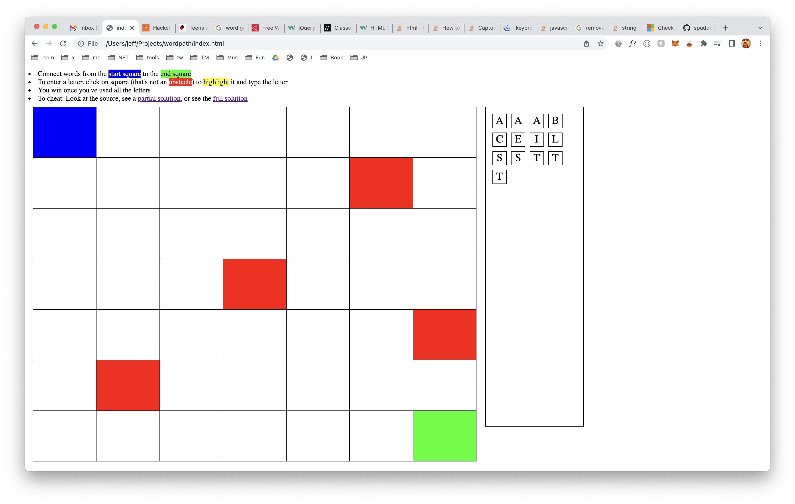
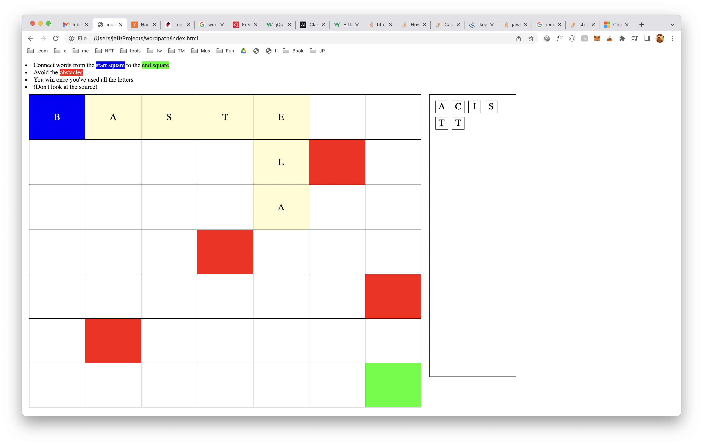

# wordpath

A word game where you try to connect words (scrabble-style) from a start square to and end square and avoid obstacles along the way.

See the [prototype](https://spudtrooper.github.io/wordpath)

An empty board currently looks like this:

A partial solution looks like this:

See the [full solution](https://raw.githubusercontent.com/spudtrooper/wordpath/main/solution.png) you fucking cheater.